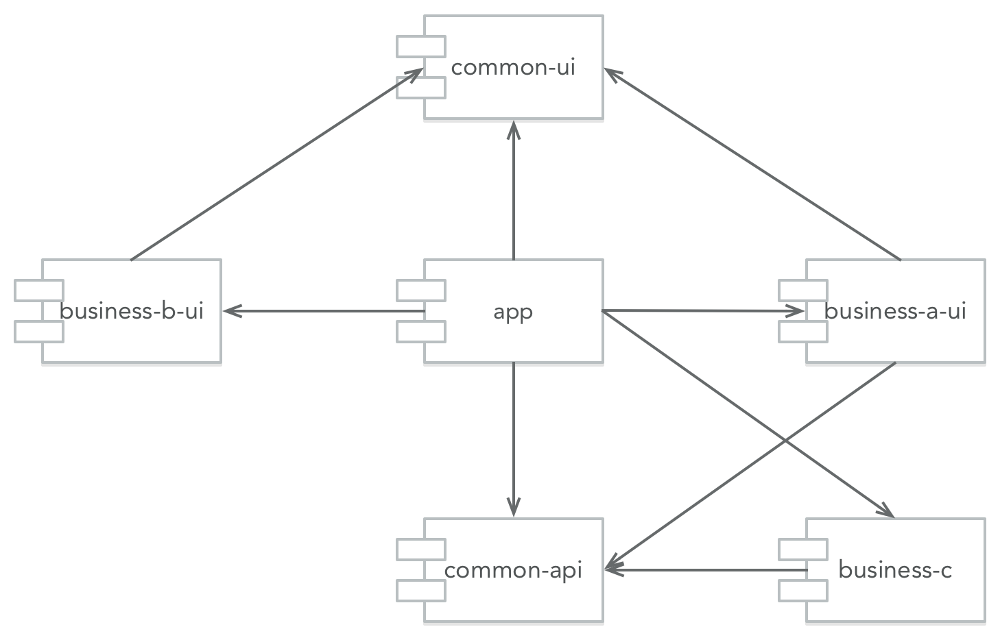
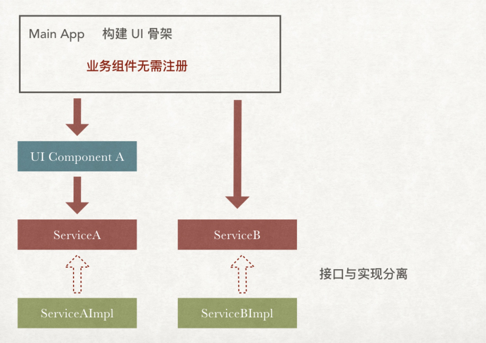

# 依赖注入实现组件化
An android modularization demo with dagger2

本文演示如何使用依赖注入的方式实现组件化，本文假设你对什么是组件化已有一定认识，并且使用过 dagger2。

本文所说的组件均是指业务组件，包括有 UI 的业务组件和 UI 无关的业务组件，业务所依赖的基础类库均是指类库，包括第三方的和公司内部的。

为了方便演示，本文所有的组件都放在同一个项目工程中，在同一个 git 仓库中，实际的场景可能是项目独有的组件放在同一个工程目录中，以及在同一个 git 仓库中，可以被多个项目共享的业务模块放在单独的工程目录以及 git 仓库中。

本文配套的示范项目:[android-modularization](https://github.com/listenzz/android-modularization)

## 组件划分


组件化的一个前提是划分组件，如图，在我们 demo 中，有一个 app 主工程，另有五个模块工程，它们之间的依赖关系如下：



app 主工程需要知道每一个组件，这样才能把它们组装起来。

common-ui 是基础的 UI 组件，它不依赖其它任何组件

business-a-ui 和 business-b-ui 是 UI 模块，它们都依赖于 common-ui，但彼此之间互不依赖

common-api 是抽象的 UI 无关的业务组件，它不依赖其它任何组件

business-c 是具体的 UI 无关的业务组件，它依赖 common-api

bisiness-a-ui 组件依赖 common-api，也就是说，UI 组件可以依赖纯业务组件

所有的组件都不依赖主工程

依赖是指我们在模块工程的 build.gradle 文件中有这样的代码

```groovy
implementation project(':common-ui')
```

## UI 组件

UI 组件是指有 UI 的业务组件

不管做什么样的 UI 界面，都离不开 Activity 或者 Fragment，想要从一个界面跳到另外一个界面，也只需要知道另外一个界面所属的 Activity 或者 Fragment 即可。

通常，我们不会直接使用 Android Framework 为我们提供的 Activity、Fragment，而是搞一个基类，比如 BaseActivity，BaseFragment。

本文采用单 Activity 架构方式为大家演示如何使用依赖注入实现组件化。单 Activity 架构不是组件化必须的，这纯粹是出于个人偏好。单 Activity 机构是指整个项目中基本只有一个 Activity，其余界面全是 Fragment。

本文使用的单 Activity 架构类库是 [AndroidNavigation](https://github.com/listenzz/AndroidNavigation)，它很好地解决了 fragment 嵌套，跳转等 fragment 相关问题，同时解决了状态栏相关问题。

我们在 common-ui 中定义了两个基类 BaseActivity 和 BaseFragment

```java
// common-ui/BaseActivity.java
// AwesomeActivity 是 AndroidNavigation 中的类
// HasSupportFragmentInjector 接口是 dagger2 的，用于依赖注入
public abstract class BaseActivity extends AwesomeActivity implements HasSupportFragmentInjector {
    @Inject
    DispatchingAndroidInjector<Fragment> supportFragmentInjector;
    
    @Override
    protected void onCreate(Bundle savedInstanceState) {
        // activity 注入需要这一行
        AndroidInjection.inject(this);
        super.onCreate(savedInstanceState);
    }
    
    @Override
    public AndroidInjector<Fragment> supportFragmentInjector() {
        return supportFragmentInjector;
    }
}
```

```java
// common-ui/BaseFragment.java
// AwesomeFragment 是 AndroidNavigation 中的类
public abstract class BaseFragment extends AwesomeFragment {
    @Override
    public void onAttach(Context context) {
        // fragment 注入需要这一行
        AndroidSupportInjection.inject(this);
        super.onAttach(context);
    }
}
```

同时还定义了一个接口，用于创建跨组件跳转的 Fragment，因为我们是单 Activity 架构，同时为了简单演示，所以这里只演示 Fragment 跳转。但也不排除另外有少量的 Activity，比如 WebViewActivity，它可能运行在另外一个进程以避免某些问题，像这种情况这里就不作演示了。

```java
// common-ui/UIComponentFactory.java
public interface UIComponentFactory {
    BaseFragment createFragment(String moduleName);
}
```

上面我们说到，business-a-ui 和 business-b-ui 彼此之间互不依赖，但如果 business-a-ui 中的页面想要跳到 business-b-ui 中的页面，怎么办呢？让我们从 UI 依赖的角度来看


图中，实心箭头表示依赖，空心箭头表示实现。

我们的 app 主工程，business-a-ui，business-b-ui 都依赖 common-ui

app 主工程实现了定义在 common-ui 中的 UIComponentFactory 这个接口。

具体流程如下：

明确 app 主工程依赖

```groovy
// app/build.gradle
dependencies {
    implementation project(':common-ui')
    implementation project(':business-a-ui')
    implementation project(':business-b-ui')
}
```

app 主工程定义一个类来注册每个 UI 组件需要向外暴露的模块

```java
// app/UIComponentRegistry.java
@Singleton
public class UIComponentRegistry {
    @Inject
    public UIComponentRegistry() {
        Log.w("Dagger", "UIComponentRegistry");
    }

    private HashMap<String, Class<? extends BaseFragment>> uiModules = new HashMap<>();

    public void registerModule(String moduleName, Class<? extends BaseFragment> clazz) {
        uiModules.put(moduleName, clazz);
    }

    public Class<? extends BaseFragment> moduleClassForName(String moduleName) {
        return uiModules.get(moduleName);
    }
}
```

在应用启动时，注册模块

```java
// app/MainApplication.java
import me.listenzz.businessa.AFragment;
import me.listenzz.businessb.EFragment;
import me.listenzz.businessb.FFragment;

public class MainApplication extends Application {
    @Inject
    UIComponentRegistry uiComponentRegistry;
    
    @Override
    public void onCreate() {
        super.onCreate();
        
        // business-a-ui 组件一共有 AFragment,BFragment,CFragment 三个 fragment
        // 在这里，仅注册一个 fragment 作为入口
        uiComponentRegistry.registerModule("A", AFragment.class);
        
        // business-b-ui 有两个入口
        uiComponentRegistry.registerModule("E", EFragment.class);
        uiComponentRegistry.registerModule("F", FFragment.class);
    }
}
```

app 主工程实现定义在 common-ui 中的 UIComponentFactory 这个接口

```java
// app/UIComponentFactoryImpl.java
public class UIComponentFactoryImpl implements UIComponentFactory {
    private UIComponentRegistry uiComponentRegistry;

    @Inject
    public UIComponentFactoryImpl(UIComponentRegistry uiComponentRegistry) {
        this.uiComponentRegistry = uiComponentRegistry;
    }

    @Override
    public BaseFragment createFragment(String moduleName) {
        Class<? extends BaseFragment> fragmentClass = uiComponentRegistry.moduleClassForName(moduleName);
        if (fragmentClass == null) {
            // DEBUG 环境下崩溃，Release 环境下可返回 404 页面
            throw new IllegalArgumentException("未能找到名为 " + moduleName + " 的模块，你是否忘了注册？");
        }
        BaseFragment fragment = null;
        try {
            fragment = fragmentClass.newInstance();
        } catch (Exception e) {
            // ignore
        }
        return fragment;
    }
}
```

在 dagger 模块中声明实现和接口的关系

```java
// app/AppModule.java
@Module
public abstract class AppModule {
    @Binds
    @Singleton
    abstract UIComponentFactory uiComponentFactory(UIComponentFactoryImpl uiComponentFactory);
}
```

如果 AFragment(business-a-ui) 想要跳到 EFragment(business-b-ui)

```java
// business-a-ui/AFragment.java
public class AFragment extends BaseFragment {
    @Inject
    UIComponentFactory uiComponentFactory;

    @Nullable
    @Override
    public View onCreateView(@NonNull LayoutInflater inflater, @Nullable ViewGroup container, @Nullable Bundle savedInstanceState) {
        View root = inflater.inflate(R.layout.a_fragment_a, container, false);
        root.findViewById(R.id.to_b_e).setOnClickListener(new View.OnClickListener() {
            @Override
            public void onClick(View v) {
                // 模块间跳转，需要通过工厂方法来获取目标页面
                BaseFragment fragment = uiComponentFactory.createFragment("E");
                getNavigationFragment().pushFragment(fragment);
            }
        });
        return root;
    }
}

```

在这个过程中，business-a-ui 不知道 business-b-ui，也根本无法知道 EFragment 是如何实现的，是原生界面？是 RN 界面？总之，除了知道对方遵从 BaseFragment 外，一无所知。

此外也对 UIComponentFactory 是如何实现的一无所知。app 主工程实现了 UIComponentFactory，但 business-a-ui 并不依赖主工程。

### 小结

UI 组件无需对外提供业务接口，它们只需要注册入口模块即可

UI 组件的基类是特殊的接口，它有很多实现，我们通过工厂方法返回合适的实现

## 业务组件

业务组件是指 UI 无关的业务组件。

和 UI 组件不同的是，系统并没有为我们的业务提供基类。因为我们的业务是唯一的独特的，我们需要自定义接口

如果需要依赖业务组件，那么依赖接口，而不是实现

当我们获取一个 UI 模块时，我们得到的是基类的引用

当我们获取一个业务 模块时，我们得到的是一个接口的引用

**我们面向的都是抽象**




业务组件不像 UI 组件那样需要注册，但它们需要定义接口

我们在 common-api 中，定义了一个业务接口，以及相关的一个 PO

```java
// common-api/Account.java
// PO
public class Account {
    public Account(String username, String type) {
        this.username = username;
        this.type = type;
    }

    public String username;
    public String type;
}
```

```java
// common-api/AccountManager.java
public interface AccountManager {
    Account login(String username, String password);
    void invalidate();
}
```

business-c 依赖 common-api 并实现了 AccountManager

```java
// business-c/AccountManagerImpl.java
public class AccountManagerImpl implements AccountManager {
    @Inject
    public AccountManagerImpl() {
    }

    @Override
    public Account login(String username, String password) {
        return new Account(username, "password");
    }

    @Override
    public void invalidate() {
        //...
    }
}

```

business-a-ui 依赖 common-api 并且想要使用 AccountManager, 可 AccountManager 只是个接口，怎么办呢？

还是需要主工程来组装

business-c 先定义一个 dagger 模块，把实现和接口绑在一起

```java
// business-c/CModule.java
@Module
public abstract class CModule {
    @Binds
    @Singleton
    abstract AccountManager provideAccountManager(AccountManagerImpl accountManager);
}
```

app 主工程把该模块加入到依赖图中 

```java
// app/AppComponent.java
@Singleton
@Component(modules = {
        AndroidSupportInjectionModule.class,
        AppModule.class,
        CModule.class, // 来自 business-c
})
public interface AppComponent extends AndroidInjector<MainApplication> {
    @Component.Builder
    abstract class Builder extends AndroidInjector.Builder<MainApplication> {
    }
}
```

business-a-ui 在代码中声明依赖

```java
// business-a-ui/AFragment.java
public class AFragment extends BaseFragment {
    @Inject
    AccountManager accountManager;
    
    @Override
    public void onActivityCreated(Bundle savedInstanceState) {
        super.onActivityCreated(savedInstanceState);
        setTitle("A 模块 A 页面");
        Account account =  accountManager.login("listenzz", "123456");
        textView.setText("用户名：" +account.username + "\n" + "登录方式：" + account.type);
    }
}
```

就这样，business-a-ui 用上了 AccountManager，但它对 business-c 一无所知。我们随时可以用 business-d 来取代 business-c，而对 business-a-ui 毫无影响。

## 业务组件如何调起 UI 组件

业务组件是指 UI 无关的业务组件

UI组件是指有 UI 的业务组件

有些时候，有些业务组件是没有 UI 的，它们可能运行在后台，当某些事件发生时，可能需要调起 UI 界面以通知用户。有两种方式来处理这种业务组件需要调起 UI 组件的情况。一种是采用订阅／发布机制，具体的实现有 EventBus，LocalBroadcast 等等，另一种是使用代理(delegate)。

下面我们就来演示如何使用代理来实现业务组件调起 UI 组件

来看 PPT


假设 business-c 在登录已经过期无效的情况下，需要通知 UI 层，如何是好呢？

可以使用 delegate pattern, 就是遇着这事，我不知道怎么办，于是我找了个代理，将此事委派与他。

首先定义一个接口

```java
// business-c/AccountManagerDelegate.java
public interface AccountManagerDelegate {
    void onInvalidation();
}
```

声明依赖此接口，并调用其中的方法

```java
// business-c/AccountManagerImpl.java
public class AccountManagerImpl implements AccountManager {
    private AccountManagerDelegate delegate;

    @Inject
    public AccountManagerImpl(AccountManagerDelegate delegate) {
        this.delegate = delegate;
    }

    @Override
    public void invalidate() {
        this.delegate.onInvalidation();
    }
}
```

app 主工程实现这一代理接口，跳到登录界面。

```java
// app/AccountManagerDelegateImpl.java
@Singleton
public class AccountManagerDelegateImpl implements AccountManagerDelegate {
    private MainApplication application;

    @Inject
    public AccountManagerDelegateImpl(MainApplication application) {
        this.application = application;
    }

    @Override
    public void onInvalidation() {
        Log.w("Dagger", "onInvalidation");
        if (application.mainActivity != null) {
            NavigationFragment navigationFragment = new NavigationFragment();
            navigationFragment.setRootFragment(new LoginFragment());
            application.mainActivity.presentFragment(navigationFragment);
        } else {
            // do something
        }
    }
}
```

实际开发中，登录界面不是由 app 主工程亲自实现的，而是由其它 UI 组件实现，主工程在实现这一代理的过程中依赖其它 UI 组件即可。

app 主工程将这一实现和接口绑定

```java
// app/AppModule.java
@Module
public abstract class AppModule {
    @Binds
    @Singleton
    abstract AccountManagerDelegate accountManagerDelegate(AccountManagerDelegateImpl delegate);
}
```

就这样，当 AccountManager 的 invalidate 方法被调用时，就会唤起一个 UI 界面，但是在这个过程中业务模块却没有依赖 UI 模块。

## 总结

其它组件对于主工程来说，就是积木，主工程负责组装它们。

UI 组件互不依赖，想要跳转，通过工厂方法和模块名创建目标页面实例

业务组件分离接口和实现

UI 组件可以依赖业务组件，但反过来不行

UI 组件不能直接依赖业务组件的实现，而应依赖其接口

UI 组件内部可以有自己独立的业务类和 PO，但不对外公开

业务组件如果需要调起 UI，可以通过事件或代理的方式

组件内部可以有自己的分层结构，比如某 UI 组件使用 MVVM 模式

[示例项目源码](https://github.com/listenzz/android-modularization)

以上只是调研过程中的产物，未实际应用于生产，请不吝赐教。


